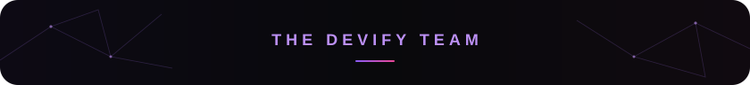
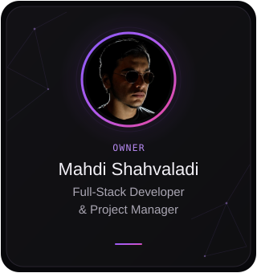
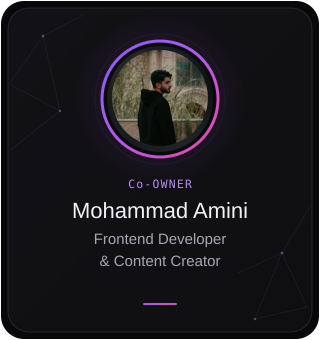
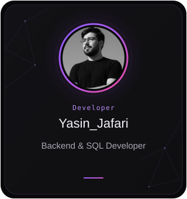
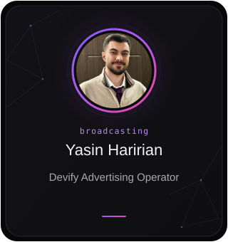
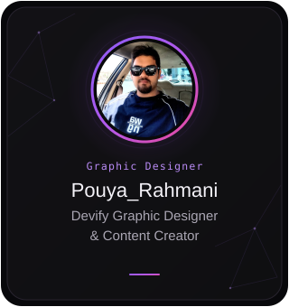
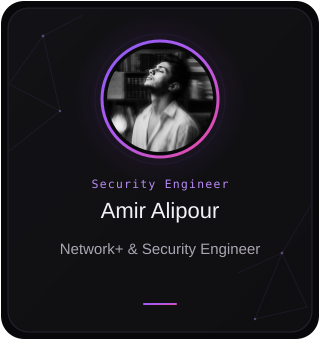

  

## `> capabilities--verbose`

| Web Systems | Data & Databases |
|:--|:--|
| Full-stack applications, dashboards, commerce experiences, responsive UI, API integration | PostgreSQL, MySQL, SQL Server, data modeling, migrations, reporting, operational support |
| **Automation & Bots** | **Infrastructure & Support** |
| Telegram bots, Discord bots, scraping pipelines, scheduled jobs, notifications | Linux, Docker, Nginx, Cloudflare, production deployment, monitoring, maintenance |

  

  

 

  

 

  

  
  

  

<!-- DEVIFY TEAM -->
 

  

  
  
  
  
  
  

